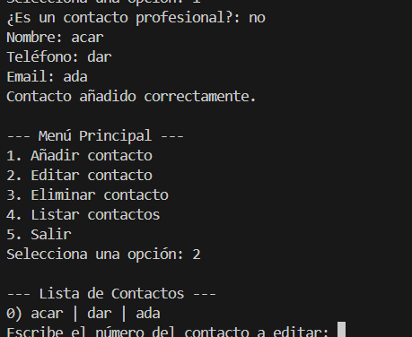

Aquí dejo capturas con el funcionamiento del menú:

Las CLASES:

Contact → clase base con atributos privados y métodos get/set (encapsulación).

ContactProfessional → hereda de Contact y añade el atributo empresa (herencia).

ContactManager → usa un ArrayList y métodos estáticos para añadir, editar, eliminar y listar contactos.

App → contiene el menú principal y permite interactuar por consola (instancia objetos y llama a los métodos del gestor).
